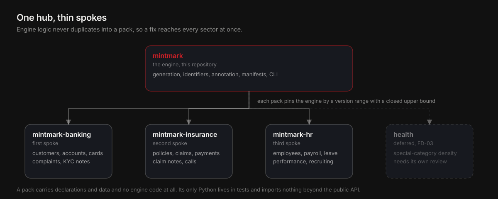

<p align="center">
  
</p>

<h1 align="center">Mintmark</h1>

<p align="center"><strong>Nerede basıldığının damgasını taşıyan, Türkçe öncelikli sentetik veri kümeleri.</strong></p>

<p align="center">
  Ne basılacağını beyan edin, bir tohum verin; etiketli veriyi, bir başkasının aynı<br>
  baytları yeniden türetip sizi denetlemesine imkân veren bir manifestoyla geri alın.
</p>

<p align="center">
  <a href="https://github.com/lokomotifai/mintmark/actions/workflows/ci.yml"></a>
  
  
  <a href="https://github.com/lokomotifai/mintmark/releases/tag/v0.3.0"></a>
  <a href="https://pypi.org/project/mintmark/"></a>
  <a href="LICENSE"></a>
</p>

<p align="center">
  <a href="https://www.python.org/"></a>
  
  
  
  <a href="docs/taxonomy.md"></a>
  <a href="README.md"></a>
</p>

<p align="center">
  <a href="#iki-dakikada-başlayın"><strong>İki dakikada başlayın</strong></a>
  ·
  <a href="#determinizm-iddiası-tam-olarak"><strong>İddiayı okuyun</strong></a>
  ·
  <a href="#varsayılmadı-doğrulandı"><strong>Neyin doğrulandığını görün</strong></a>
  ·
  <a href="README.md"><strong>English</strong></a>
</p>

---

> **Üretim yolunun hiçbir yerinde model yok.** Ne bir cümle yazmak için, ne bir
> ad seçmek için, ne de bir dağılımı yumuşatmak için. Her değer tohumlu bir
> akıştan, derlenmiş bir sözlükten ya da beyan edilmiş bir gramerden gelir;
> böylece her karakterin kökeni okuyabileceğiniz bir dosyaya kadar izlenebilir.

Türk kurumları üretim verisini KVKK riski almadan test, değerlendirme veya yapay
zekâ pilot ortamlarına taşıyamaz ve yerine koyacak gerçekçi bir şeyleri de
olmamıştır. Mintmark o veriyi basar: tamamen sentetik, Türkçe öncelikli,
deterministik, span düzeyinde etiketli ve bir köken manifestosuyla mühürlenmiş.

Ad nümismatikten geliyor. Mint mark, bir darphanenin madeni paraya nerede
basıldığını söylemek için vurduğu küçük harftir. Bir Mintmark veri kümesi aynı
şeyi manifestosunda taşır; böylece altı ay sonra ortaya çıkan bir veri kümesi
kendisini neyin ürettiğini hâlâ söyleyebilir.

**PyPI'de [`mintmark`](https://pypi.org/project/mintmark/) olarak
yayımlanmıştır.** 890 test geçiyor, on sekiz invariant'ın hepsinin adlandırılmış
testi var ve bayt düzeyindeki determinizm iddiası tek bir platformdan varsayılmak
yerine tek bir CI koşusunda üç platformda gözlemleniyor.

> [!IMPORTANT]
> **Mintmark ne değildir.** Gerçek verinin anonimleştirilmesi veya maskelenmesi
> değildir; hiç gerçek veri almaz ve sizinkini güvenli hale getiremez. Hukuki
> tavsiye değildir, uyumluluk garantisi değildir. Sentetik gerçekçiliğin sınırları
> vardır: veri, gerçek bir popülasyonu değil beyan edilen dağılımları ve derlenmiş
> sözlükleri izler; dolayısıyla buradan çıkarılan sonuçlar beyanlar hakkındaki
> sonuçlardır. Üretilen telefon numaraları atanmış numaralarla çakışabilir, çünkü
> Türkiye numara planı kurgusal bir aralık ayırmaz. Bu veri sistemleri test etmek
> içindir. Hiçbir zaman kimseye ulaşmak için değildir.

## Değer birimi tek resimde


<p align="center"><sub><a href="assets/readme/mint-pipeline.svg">Erişilebilir SVG kaynağını görüntüleyin</a></sub></p>

Çoğu sentetik veri aracı makul kayıtlar üretmeyi kolaylaştırır. Mintmark bunun
etrafında olup bitenle ilgilenir:

| Soru | Mintmark'ın yanıtı |
| --- | --- |
| Bu tanımlayıcı gerçek bir kişiye ait olabilir mi? | Hayır. Safe mod kanıtlanabilir şekilde checksum geçersiz değerler üretir ve `verify` bunu ispatlamak için bir tüketicinin uygulayacağı doğrulayıcının aynısını çalıştırır. |
| Gelecek ay aynı veriyi alır mıyım? | Evet, bayt bayt; aynı motor sürümü, paket özeti, tarif, tohum, politika ve biçimle. |
| Bu dosya dizinini ne üretti? | `MINTMARK.json`; motoru, paket özetini, tarifi, tohumu, politikayı, taksonomi pinini ve her sağlama toplamını birbirine bağlar. |
| Etiketlerin hizalı olduğunu nereden bilirim? | Her span, yüzeyi yerleştirilirken kaydedilir ve `verify` her birini indekslediği metinden yeniden çıkarır. |
| Bunların hiçbirini size güvenmeden denetleyebilir miyim? | Evet. `mintmark reproduce` yalnızca manifestodan yeniden basar ve baytları karşılaştırır. |
| Veri fiilen ne içeriyordu? | Manifesto, ulaşılan dağılımları ve etiket kapsamını hedeflerin yanına, tutturulmuş olsun olmasın kaydeder. |

## İki dakikada başlayın

Bağımlılık kurulumundan sonra çevrimdışı. Anahtar yok, hesap yok, ağ yok.

```bash
uv tool install mintmark        # veya: pip install mintmark
mintmark mint --pack example --recipe demo --seed 42 --out ./demo-run
mintmark verify ./demo-run
```

`demo-run/` şunları içerir:

```
customer.jsonl                 100 kayıt, satır başına bir JSON nesnesi
transaction.jsonl              100 kayıt, her biri işlenmiş bir açıklama ile
transaction.labels.jsonl       her açıklamaya span uzaklıkları
MINTMARK.json                  köken manifestosu
SHA256SUMS                     üretilen her dosya için bir sağlama toplamı
```

ve `mintmark verify` tam olarak şunu yazar:

```
manifest schema: valid
checksums: 3/3 match
identifier policy: safe (confirmed)
checksum-valid identifiers found: 0
coverage targets: 0 checked
taxonomy: hushmark-tr v0.1, pin af11b31e4916
label alignment: 100 documents, 89 spans
dataset license: CC-BY-4.0
attribution: mintmark-example 0.1.0 reference dataset (recipe demo, seed 42), lokomotifai, licensed CC-BY-4.0
authenticity: self-consistency only; no trusted manifest digest supplied
```

Bir test bu bloğu `verify`'ın gerçekten yazdığıyla karşılaştırır; böylece bu
örnek güncel görünürken bayatlayamaz.

Üretildiği hâliyle bir kayıt:

```json
{"customer_id":"CUST-00000000","first_name":"Kaan","last_name":"Kılıç","national_id":"71773625043","email":"kaan.kilic.1256@example.org","phone":"+90 525 886 73 05","il":"Batman","segment":"affluent","balance_kurus":277663,"currency":"TRY"}
```

Oradaki her alan sentetiktir. Kimlik numarası kendi kontrol basamağı kuralında
düşer. Adres kimsenin kaydettiremeyeceği bir alan adı altındadır. Bakiye tamsayı
kuruştur, çünkü kayan nokta üretilen baytları platformun insafına bırakırdı.

## Tanımlayıcılar gerçek olamaz

Altı motor; her birinin `safe` varsayılanı ve opsiyonel `validator` modu var.
Safe mod bir vaat değil, doğrulayıcının artefaktlar üzerinde yeniden denetlediği
bir özelliktir.

| Motor | Safe bir değeri gerçek olamaz kılan şey |
| --- | --- |
| **TCKN** | Her iki kamusal kontrol kuralı doğru hesaplanır, sonra ikincisi sıfırdan farklı bir kaydırmayla bozulur. Numaranın görünen biçimi bozulmaz ve geçersizlik tam da bir denetleyicinin baktığı yerde durur. |
| **VKN** | Aynısı; üstelik tek satırı yazılmadan önce iki bağımsız açık implementasyona karşı 200 000 girdide doğrulanmış bir algoritma üzerinde. |
| **IBAN** | Kontrol basamakları 02 ile 98 arasındaki kabul edilebilir pencerede kaydırılır ve banka kodu `99999`'dur; TCMB katılımcı listesinde bulunmadığı doğrulanmıştır. Validator modundaki bir IBAN bile hiçbir gerçek kurumu adlandırmaz. |
| **PAN** | `9` ile başlayan on altı hane; hiçbir ticari kart ağının kullanmadığı bir sektör tanımlayıcısı. Bu, her iki politikada da geçerlidir. Varsayılan üretim maskelidir. |
| **PHONE** | Yalnızca biçim doğru. Türkiye numara planı kurgusal bir mobil aralık ayırmadığı için çakışma mümkündür. Bu gizlenmez, belgelenir ve amaç sınırlaması bundan çıkar: sistemleri test edin, asla kimseye ulaşmayın. |
| **EMAIL** | Yalnızca `.example` ve `example.com` ailesi; RFC 2606 ve RFC 6761 ile rezerve edilmiştir, kimse kaydettiremez. |

`validator` modu, kendi doğrulama mantığınızı geçerli bir şeye karşı test
edebilesiniz diye vardır. Basım başına opsiyoneldir ve bu modda basılan her veri
kümesi, `verify`'ın eksikliğini kabul etmediği bir uyarı bloğu taşır.

## Determinizm iddiası, tam olarak

> Aynı motor sürümü, paket özeti, tarif, tohum, tanımlayıcı politikası ve çıktı
> biçimi; CPython 3.12 üzerinde Linux x86_64, Linux arm64 ve macOS arm64'te bayt
> bayt aynı veri dosyalarını ve etiket dosyalarını üretir.

Manifestonun `provenance` bloğu, yani oluşturma zaman damgası ve çağrı satırı,
hariçtir. Manifestodaki diğer her şey dahildir. Windows iddia edilmez ve test
edilmez.

Her terim yük taşır ve iddia dar tutulmuştur, çünkü onu tutmak birinin işidir.
İddiayı ayakta tutan şeyler:

| Kısıt | Neden |
| --- | --- |
| Üretilen veride kayan nokta yok | Bir kayan noktanın metin biçimi, platformun ikili yaklaşımı biçimlendirmesine bağlıdır. Para tamsayı kuruş, oranlar ondalık dizgidir. |
| Basım yolunda transandantal çağrı yok | libm sonuçları platformlar ve libm sürümleri arasında değişir. Log-normal tutarlar çevrimdışı üretilmiş 1024 düğümlü ters CDF tablolarından, tamsayı aritmetiğiyle interpole edilerek gelir. |
| Her üretim noktası için ayrı akış | Bir alan eklemek başka hiçbir alanın değerlerini kaydırmaz. Tek paylaşılan akış, ekleme noktasından sonrasını kaydırır ve yayımlanmış her manifestoyu sessizce geçersizleştirirdi. |
| Akış türetmesinde NUL ayracı | Ayraç olmazsa `ab` adlı `c` sürümü paket ile `a` adlı `bc` sürümü paket aynı özeti verir; iki akış tek akışa çakışır. |
| Modulo değil, red örneklemesi | Modulo ilk kalan sınıflarını fazla temsil eder. Amacı adillik olan bir fikstür, kimsenin beyan etmediği bir çarpıklığı taşıyamaz. |
| Serileştirmede bildirim sırası | Sıralı değil, ekleme sırası da değil. Bir serileştirici değişikliği, var olmayan bir uyuşmazlığı bildirmemelidir. |

`tests/golden/demo-run/` yeniden çalıştırma değil, commit'lenmiş baytlar tutar.
Tek süreçte iki kez basmak kodun girdilerinin bir fonksiyonu olduğunu kanıtlar;
bugünkü kodun dünkiyle aynı fonksiyon olduğunu yalnızca commit'lenmiş baytlar
kanıtlar.

## Mintmark neyi korur, neyi korumaz

| Yapar | Yapmaz |
| --- | --- |
| Hiç gerçek veri almadığı için gerçek kişisel bilgi içermeyen veri üretir | Gerçek verinizi anonimleştirmez veya maskelemez. O sınır [Hushmark](https://github.com/lokomotifai/hushmark)'ın tarafıdır |
| Üçüncü bir tarafın veri kümesini yeniden türetip denetlemesini sağlayan bir kayıt verir | O veri kümesini herhangi bir amaç için belgelendirmez, hiçbir uyumluluk iddiası taşımaz |
| Bir dedektörün puanlanabilmesi için span'leri kapalı bir taksonomiye göre etiketler | Dedektörünüzün yeterince iyi olup olmadığını söylemez |
| Bayt iddiasının tam olarak hangi platformları kapsadığını söyler | Gözlemlenmediği platformları kapsamaz |
| Üretilen her kurumu kurgusal tutar ve gerçek kurum listesine karşı tarar | Bir adın her yargı alanında ve sicilde sahipsiz olduğunu garanti etmez |
| Varsayılan olarak checksum geçersiz tanımlayıcılar üretir | Bir telefon numarasının atanmış bir numarayla çakışmasını engelleyemez; çekilecek kurgusal aralık yoktur |

Mintmark hukuki tavsiye değildir, uyumluluk garantisi değildir. Yazılımın ne
yaptığını anlatır. Bunu kendi yükümlülüklerinize eşlemek sizin işinizdir.

## Tek merkez, ince kollar



<p align="center"><sub><a href="assets/readme/family-topology.svg">Erişilebilir SVG kaynağını görüntüleyin</a></sub></p>

Bu depo motordur. Sektör paketleri, hiç motor kodu içermeyen, bildirim ve veri
taşıyan ayrı depolardır: içlerindeki tek Python testlerde yaşar ve kamusal API
dışında hiçbir şeyi içe aktarmaz.

| Depo | Durum | İçerik |
| --- | --- | --- |
| **mintmark** | bu depo | üretim, tanımlayıcılar, etiketleme, manifestolar, CLI, bir örnek paket |
| **[mintmark-banking](https://github.com/lokomotifai/mintmark-banking)** | birinci kol | müşteriler, hesaplar, kartlar, işlemler, şikâyetler, KYC notları, destek dökümleri |
| **[mintmark-insurance](https://github.com/lokomotifai/mintmark-insurance)** | ikinci kol | poliçe sahipleri, poliçeler, hasarlar, ödemeler, hasar notları, çağrı dökümleri |
| **[mintmark-hr](https://github.com/lokomotifai/mintmark-hr)** | üçüncü kol | çalışanlar, pozisyon geçmişi, izin, bordro, performans ve işe alım notları, İK talepleri |
| sağlık | ertelendi | Özel nitelikli veri yoğunluğu, brief yazılmadan önce daha sıkı bir yönetişim incelemesi ister |

Her paket bu motoru kapalı üst sınırlı bir sürüm aralığıyla sabitler; böylece
gelecekteki bir motor, yayımlanmış bir manifestonun neyi yeniden ürettiğini
sessizce değiştiremez.

## Varsayılmadı, doğrulandı

Bu projenin dayandığı dört olgu, buradaki hiçbir belgede değil, kamusal
sicillerde ve şartnamelerde yaşıyor. Bunları hafızadan yazmak, kendinden emin
biçimde yanlış bir yazılım üretirdi; bu yüzden her biri birincil kaynaklara karşı
denetlendi ve kaydı tutuldu.

| Olgu | Kaynak | Sonuç |
| --- | --- | --- |
| VKN kontrol basamağı algoritması | Farklı dillerde, farklı yazarlarca yazılmış iki bağımsız açık implementasyon | 200 000 rastgele girdide sıfır uyuşmazlık; ikisi de yayımlanmış test vektörünü üretiyor |
| IBAN banka kodu `99999` atanmamış | TCMB Ödeme Sistemleri Katılımcıları, 072025 revizyonu | 71 katılımcı, kodlar 0001 ile 0807 arasında, 9xxxx aralığında hiçbir şey yok |
| Türkiye kalıcı olarak UTC+3 | IANA saat dilimi veritabanı | 2017 ile 2030 arasında tek offset, örneklenen her anda yaz saati sıfır |
| Kurum denylist'i | Aynı TCMB listesi | 71 katılımcının tamamını kapsayan 70 giriş, her biri bir testle kendi kaynağına geri eşleşiyor |

Erişim tarihleriyle birlikte tam kayıtlar
[docs/normative-verification.md](docs/normative-verification.md) içinde. Sapabilen
ikisi, ayrı ve ağ etiketli bir iş akışıyla haftalık olarak yeniden denetlenir; bu
akış issue açar ve kendi başına hiçbir şeyi güncellemez.

## Depo haritası

```
src/mintmark/
  engine/         akışlar, SplitMix64, yansız çekimler, sabit noktalı tablolar, şablonlar
  identifiers/    tckn, vkn, iban, pan, phone, email; safe ve validator modları
  annotate/       kapalı taksonomi, span kaydı, render, etiket dosyaları
  packs/          katı fail-closed yükleme, şemalar, kanonik paket özeti
  emit/           kanonik JSONL ve CSV, atomik çıktı
  manifest/       MINTMARK.json, sağlama toplamları, verify
  lexicons/       Türkçe temel sözlükler ve kurum denylist'i
  mint.py         katmanların buluştuğu kompozisyon kökü
  cli.py          yedi komut, beş çıkış kodu, kararlı JSON yükleri
schemas/          paket ve manifesto JSON Şemaları, sürümlenmiş
packs/example/    hızlı başlangıcın kullandığı örnek paket
assets/           commit'lenmiş dağılım tabloları ve denylist
tools/            çevrimdışı tablo üreteci, prose lint, canary kontrolü
tests/            birim, özellik, golden, düşman, uygunluk
```

Modül bağımlılık yönü zorunlu CI'da `import-linter` ile uygulanır ve `engine`
yalnızca standart kütüphaneyi içe aktarır. Bu düzenlilik kaygısı değildir:
determinizm iddiasını denetlenebilir kılan şeydir, çünkü motorun ürettiği her
değer bir bağımlılığın yayın takviminden değil, bu deponun tarif ettiği
aritmetikten gelir.

## Depoyu geliştirin

```bash
uv sync
uv run ruff format --check . && uv run ruff check .
uv run mypy --strict src/
uv run lint-imports
uv run pytest
uv run python tools/mdlint.py .
```

Bağımlılıklar kurulduktan sonra hepsi çevrimdışı çalışır. Karşılaşmadan önce
bilmeye değer iki kontrol var.

`tools/mdlint.py` düzyazı üzerindeki dil kurallarını her iki dilde uygular: cümle
düzeninde başlıklar, yasaklı bir tanıtım sözcük listesi ve hiçbir yerde em dash
veya en dash bulunmaması. Alıntılanan üçüncü taraf metni, gerekçe taşımak zorunda
olan bir işaretle muaf tutulur.

`tools/canary.py` özel planlama materyalinin ağaçta ve derlenmiş artefaktlarda
bulunmadığını kanıtlar. Canary dizgisi asla commit'lenmez, çünkü commit'lemek
kontrolün aradığı şeyi ekmek olurdu; dizgi `MINTMARK_CANARY` üzerinden gelir ve
burada yalnızca özeti durur.

## Proje durumu

Sürüm 0.1, ön yayın. Semantik sürümleme altındaki kamusal yüzey: komut satırı
grameri, çıkış kodları, `--json` yükleri, kütüphanenin iki fonksiyonu, iki JSON
Şeması ve sabit bir tohumun ürettiği baytlar.

Sonuncusu vurgulanmayı hak eder. **Sabit bir tohum için üretilen baytları
değiştiren bir değişiklik, hiçbir imza kımıldamasa bile ana sürüm olayıdır**,
çünkü yayımlanmış her manifestonun yeniden üretilebilirliğini bozar.

PyPI'de [`mintmark`](https://pypi.org/project/mintmark/) olarak yayımlandı ve
GitHub'da wheel, kaynak dağıtımı ve bir yazılım malzeme listesiyle sürüldü.
Yayımlama, onay kapısının arkasında OIDC üzerinden güvenilir yayımlama ile
yapılır; bu depoda uzun ömürlü hiçbir belirteç yoktur.

Ad donduruldu. Marka taraması 2026-08-22'de temiz sonuçlandı ve PyPI ad alanı
proje tarafından tutuluyor.

## Topluluk sözleşmesi

Katkılar, katkı lisans sözleşmesi olmaksızın Developer Certificate of Origin 1.1
kapsamında kabul edilir. Çalıştırılacak kontroller ve uyulacak dil kuralları için
[CONTRIBUTING.md](CONTRIBUTING.md), kararların nasıl alındığı ve tek maintainer
kuralının bugün ne olduğu için [GOVERNANCE.md](GOVERNANCE.md), özel bildirim yolu
ve burada neyin güvenlik açığı sayıldığı için [SECURITY.md](SECURITY.md).

[README.md](README.md) kanoniktir ve bu belge özet değil, tam bir aynadır.
Birinde yapılan değişiklik diğerinde yapılmazsa inceleme başarısız olur ve bir
test ikisinin yapısını karşılaştırır.

## Belgeler

| Belge | Kapsamı |
| --- | --- |
| [docs/determinism.md](docs/determinism.md) | İddia, her terimin neden dar olduğu ve yayımlanmış bir veri kümesinin nasıl yeniden üretileceği |
| [docs/taxonomy.md](docs/taxonomy.md) | On sekiz etiket, pin ve üst kaynak kımıldadığında ne olacağı |
| [docs/normative-verification.md](docs/normative-verification.md) | Neyin, hangi kaynağa karşı, hangi tarihte, hangi sonuçla doğrulandığı |
| [docs/engineering-notes.md](docs/engineering-notes.md) | Derleme tuhaflıkları, ortam tuzakları ve invariant-test haritası |

## Bu neden var

hushmark-tr model kartı, benimseyenlerden dedektörü üretimde kullanmadan önce
temsili veriyle değerlendirmelerini ister. Bu dürüst bir sınırlamadır ve
Türkçede dürüst bir karşılığı yoktu: temsili veri mevcut değildi ve onu üretmek
için üretim verisi kullanılamazdı.

Mintmark o karşılıktır. Bir kardeşin beyan ettiği sınırlama, diğer kardeşin ürün
tanımıdır.

## Lisans ve marka

Kod Apache-2.0'dır. Bakınız [LICENSE](LICENSE) ve [NOTICE](NOTICE).

Bu motorun ürettiği veri kümeleri, paketin bildirdiği koşulları taşır; koşullar
`MINTMARK.json` içine yazılır ve `verify` tarafından yazdırılır. Ailedeki her
paket **CC BY 4.0** bildirir: atıf koşuluyla, ticari dahil her kullanım. Bakınız
[LICENSE-DATASETS.md](LICENSE-DATASETS.md).

Sentetik bir veri kümesinin Türk veri koruma hukuku karşısında ne anlama
gelip gelmediği [docs/kvkk.tr.md](docs/kvkk.tr.md) dosyasında açıklanmıştır.

Lisans, Mintmark adı veya logosu üzerinde hiçbir hak vermez. Adil topluluk
kullanımının neyi kapsadığı için bakınız [TRADEMARKS.md](TRADEMARKS.md).

<p align="center"><sub>lokomotifai ailesinin parçası: <a href="https://github.com/lokomotifai/pactmark">Pactmark</a> ajan çalıştırmayı mühürler · <a href="https://github.com/lokomotifai/hushmark">Hushmark</a> veri çıkışını mühürler · <a href="https://github.com/lokomotifai/permitmark">Permitmark</a> sır girişini mühürler · Mintmark veri arzını mühürler</sub></p>
